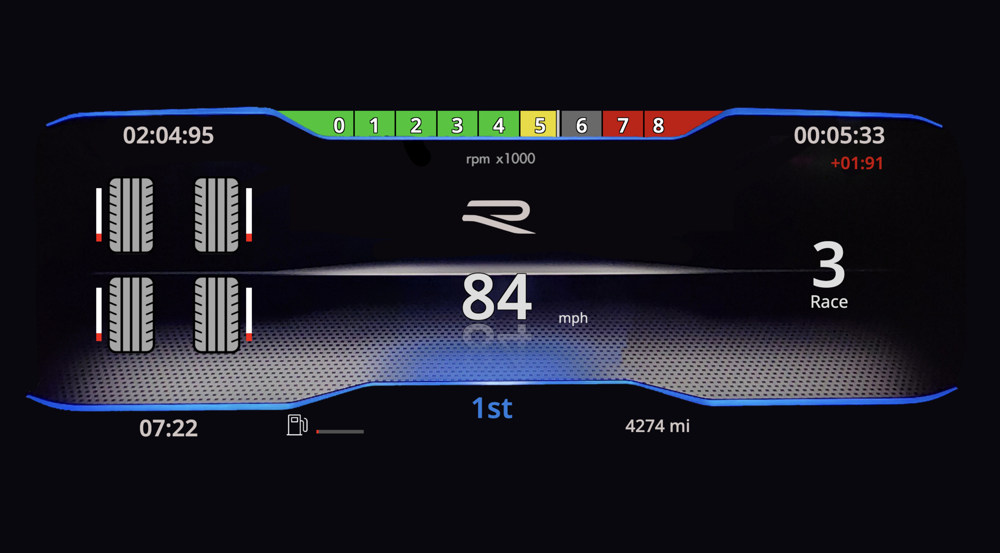

# Sim-Dash

A customizable telemetry dashboard system for racing and rally simulation games. Features multiple dash styles (Golf R, Rally, TCR), real-time telemetry visualization, timing splits, and per-car odometers.

<div align="center">
   
</div>

---

## Supported Games

### Forza
- **Forza Motorsport**
- **Forza Horizon 5**
- **Forza Motorsport 7**
- **Forza Horizon 4**

### Rally
- **EA WRC**
- **Dirt Rally 2.0**
- **Dirt Rally**

### Assetto Corsa
- **Assetto Corsa**
- **Assetto Corsa Competizione**

---

## Setup

### Overview

- **Server Setup**: Get the Docker container running.
- **Dash Setup**: Learn how to access and configure the dashboard.
- **Forza Setup**: Configure the game to stream telemetry data.

---

<details>
<summary>Server Setup</summary>

### Requirements

- **Docker** must be installed on your system.

### Usage

#### 1. Build and Start the Container
```bash
./docker.sh
```
- Builds the `sim-telemetry` Docker image (if it does not exist) and starts the container with the specified ports and volume mappings.

---

### Configuration

#### Docker Variables
- **`IMAGENAME`**: Name of the Docker image (`sim-telemetry`).
- **`CONTAINERNAME`**: Name of the Docker container (`sim-telemetry-container`).
- **`PORTS`**: Ports exposed by the container (`8888`, `3000`, `9999`).

### Script Details
- **`./docker.sh`**: Builds and starts the container.
- **`./docker.sh stop`**: Stops the container.
- **`./docker.sh restart`**: Stops, removes, rebuilds, and restarts the container.
- **`./docker.sh remove`**: Stops and removes the container.
- **`./docker.sh enter`**: Opens a shell inside the running container.

</details>

---

<details>
<summary>Dash Setup</summary>

### Accessing the Dashboard and Game Selection

1. **Game Selection**:
   - Open a web browser and go to `http://<IP>:3000` (replace `<IP>` with the actual IP address of the machine running the Docker container).
   - This page allows you to select the game you want to use with the telemetry system.

2. **Dashboard Gauge Cluster**:
   - Access the telemetry dashboard at `http://<IP>:3000/dash`.
   - This page displays real-time telemetry data in your selected dash style.

#### Game Selection

- Games are organized by category (Forza, Rally, Assetto Corsa)
- Click a category to expand and see available games
- Click a game to start telemetry streaming
- Games are dynamically loaded from `web-server/data/games.json` for easy configuration

#### Configuration Options

**Config Button** - Opens configuration modal:
- **Dash Style**: Choose between Golf R, Rally, or TCR dash layouts
- **Shift Light Type**: Off, Left-Right, or Outside-In patterns
- **Split Type**: Class, Car, or Session-based timing splits

**Port Config Button** - Configure UDP port settings:
- **Toggle**: Enable/disable custom port (default: 9999)
- **Port Number**: Set custom UDP port (1024-65535)
- Useful for SimHub integration or custom telemetry setups

**Stop Button** - Halts the telemetry process and resets the dashboard

#### Dashboard Scaling and Positioning

- Click **"Scale Dash"** to open the scaling and position adjustment interface.
- **Adjusting Settings**:
  - **Scale Up**: Increase dashboard size.
  - **Scale Down**: Decrease dashboard size.
  - **Move Up**: Shift dashboard upward.
  - **Move Down**: Shift dashboard downward.

#### Saving Dashboard Layouts

- After making adjustments:
  - Enter a name for your layout in the input field.
  - Click **Save** to store the layout.
- Layouts are saved server-side and can be loaded later.

#### Loading Saved Layouts

- When clicking **"Scale Dash"**, you'll see a list of available layouts.
- Select a layout to apply it, or choose "Custom" to define a new layout.


</details>

---

<details>
<summary>Game Setup</summary>

### Forza (Motorsport/Horizon)

1. **Open Forza** on your gaming platform
2. Navigate to **Settings > HUD and Gameplay**
3. Locate **Data Out** or **UDP Telemetry** settings
4. Set **IP address** to the machine running the Docker container
5. Set **Port** to `9999` (or your custom port)

### Dirt Rally / EA WRC

1. **Navigate to game installation directory**
2. Find `hardware_settings_config.xml` (usually in Documents/My Games/)
3. Configure UDP settings:
   ```xml
   <udp enabled="true" extradata="3" ip="127.0.0.1" port="9999" delay="1" />
   ```
4. Replace IP with your Docker host machine IP
5. Set `extradata="3"` for full telemetry data

### Assetto Corsa

1. **Enable UDP telemetry** in game settings
2. Set **UDP Port** to `9999` (or your custom port)
3. Set **UDP IP** to the Docker host machine IP

### Assetto Corsa Competizione

1. Navigate to game installation folder
2. Edit broadcasting configuration
3. Configure UDP output to Docker host IP and port

---

### Adding New Games

Games are configured in `web-server/data/games.json`:

```json
{
  "categories": [
    {
      "name": "Category Name",
      "games": [
        {
          "name": "Display Name",
          "id": "GAMECODE"
        }
      ]
    }
  ]
}
```

The `id` field is the game code that serves as the prefix for the packet format file.

**Example:** If `"id": "FM"`, create the packet format file at:
- `telemetry/packets/FM_packetformat.dat`

This file defines the UDP packet structure for the game's telemetry data.

</details>
